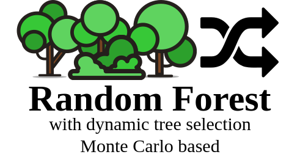

# Random Forest with Dynamic Tree Selection Monte Carlo Based (RF-TSMC)


[](https://www.python.org/downloads/release/python-370/)


This project is about use Random Forest approach for *multiclass classification* using a dynamic tree selection Monte Carlo based. The first implementation is found in [2] (using Common Lisp).

#### Development status: `WIP and unstable, version 0.1.1`.

## Install:

Install using `pip`:

```bash
$ pip3 install random-forest-mc
```

Install from this repo:

```bash
$ git clone https://github.com/ysraell/random-forest-mc.git
$ cd random-forest-mc
$ pip3 install .
```

## Usage:

Example of a full cycle using `titanic.csv`:

```python
import numpy as np
import pandas as pd

from random_forest_mc.model import RandomForestMC
from random_forest_mc.utils import LoadDicts

dicts = LoadDicts("tests/")
dataset_dict = dicts.datasets_metadata
ds_name = "titanic"
params = dataset_dict[ds_name]
dataset = (
    pd.read_csv(params["csv_path"])[params["ds_cols"] + [params["target_col"]]]
    .dropna()
    .reset_index(drop=True)
)
dataset["Age"] = dataset["Age"].astype(np.uint8)
dataset["SibSp"] = dataset["SibSp"].astype(np.uint8)
dataset["Pclass"] = dataset["Pclass"].astype(str)
dataset["Fare"] = dataset["Fare"].astype(np.uint32)
cls = RandomForestMC(
    n_trees=8, target_col=params["target_col"], max_discard_trees=4
)
cls.process_dataset(dataset)
cls.fit()
y_test = dataset[params["target_col"]].to_list()
y_pred = cls.testForest(dataset)
accuracy_hard = sum([v == p for v, p in zip(y_test, y_pred)]) / len(y_pred)
y_pred = cls.testForest(dataset, soft_voting=True)
accuracy_soft = sum([v == p for v, p in zip(y_test, y_pred)]) / len(y_pred)
```

### Notes:

- Classes values must be converted to `str` before make predicts.

### LoadDicts:

LoadDicts works loading all `JSON` files inside a given path, creating an object helper to use this files as dictionaries.

For example:
```python
>>> from random_forest_mc.utils import LoadDicts
>>> # JSONs: path/data.json, path/metdada.json
>>> dicts = LoadDicts("path/")
>>> # you have: dicts.data and dicts.metdada as dictionaries
>>> # And a list of dictionaries loaded in:
>>> dicts.List
["data", "metdada"]
```

## Fundamentals:

- Based on Random Forest method principles: ensemble of models (decision trees).

- In bootstrap process:

    - the data sampled ensure the balance between classes, for training and validation;

    - the list of features used are randomly sampled (with random number of features and order).

- For each tree:

    - fallowing the sequence of a given list of features, the data is splited half/half based on meadian value;

    - the splitting process ends when the samples have one only class;

    - validation process based on dynamic threshold can discard the tree.

- For use the forest:

    - all trees predictions are combined as a vote;

    - it is possible to use soft or hard-voting.

- Positive side-effects:

    - possible more generalization caused by the combination of overfitted trees, each tree is highly specialized in a smallest and different set of feature;

    - robustness for unbalanced and missing data, in case of missing data, the feature could be skipped without degrade the optimization process;

    - in prediction process, a missing value could be dealt with a tree replication considering the two possible paths;

    - the survived trees have a potential information about feature importance.

    - Robust for mssing values in categorical features during prediction process.

### References

[2] [Laboratory of Decision Tree and Random Forest (`github/ysraell/random-forest-lab`)](https://github.com/ysraell/random-forest-lab). GitHub repository.

[3] Credit Card Fraud Detection. Anonymized credit card transactions labeled as fraudulent or genuine. Kaggle. Access: <https://www.kaggle.com/mlg-ulb/creditcardfraud>.

### Development Framework (optional)

- [My data science Docker image](https://github.com/ysraell/my-ds).

With this image you can run all notebooks and scripts Python inside this repository.

### TODO v1.0:

- Add parallel processing using or TQDM or csv2es style.
- Mssing data issue:
    - Prediction with missing values: `useTree` must be functional and branching when missing value, combining classes at leaves with their probabilities.
    - Data Imputation using the Forest.
- [Plus] Add a method to return the list of feaures and their degrees of importance.
- Docstring.

### TODO V2.0:

- Extender for predict by regression.
- Refactor to use NumPy or built in Python features as core data operations.
- Add new class derived with a weighted tree voting using survived scores.
